# Wiki LCD / Resina: Guía rápida de CHITUBOX

Aprende el flujo básico para preparar un archivo de impresión 3D en resina usando CHITUBOX: agregar impresora, importar modelo, orientar, vaciar, colocar soportes, laminar y guardar el archivo.

---

## 1. ¿Qué es CHITUBOX?

CHITUBOX es un software laminador para impresoras de resina. Su función es convertir un modelo 3D, como STL, OBJ o 3MF, en un archivo que la impresora pueda leer capa por capa.

Con CHITUBOX puedes:

- configurar tu impresora LCD, MSLA o DLP;
- importar modelos 3D;
- mover, rotar y escalar piezas;
- vaciar modelos y agregar agujeros de drenaje;
- generar soportes;
- configurar exposición, altura de capa y velocidades;
- laminar y guardar el archivo final.

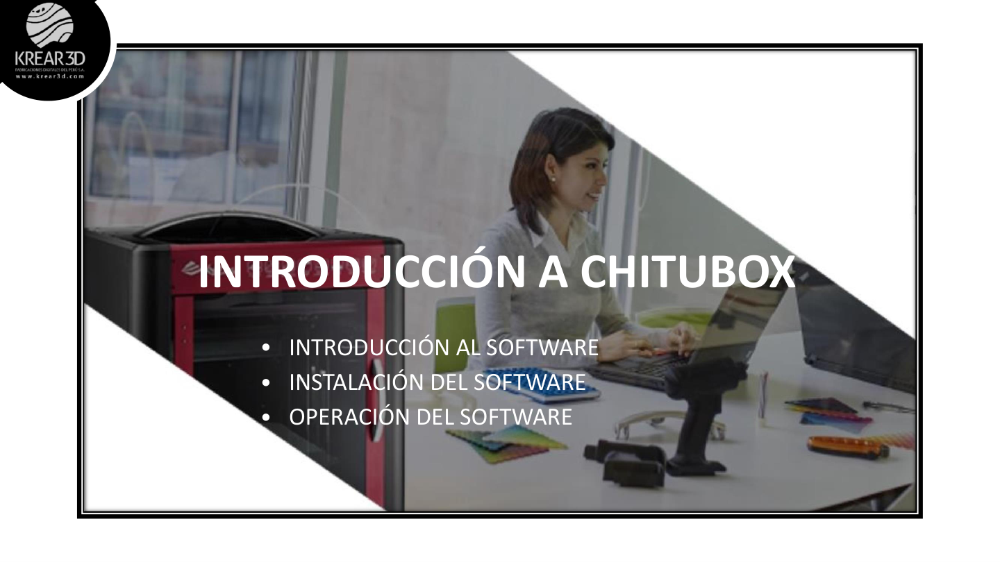

**Recomendación K3D:** usa CHITUBOX como guía general para resina. Para algunos equipos Anycubic, también puede usarse Photon Workshop si el equipo lo requiere.

---

## 2. Descargar e instalar CHITUBOX

Pasos sugeridos:

1. Ingresa a la web oficial de CHITUBOX.
2. Descarga la versión compatible con tu sistema operativo.
3. Instala el programa siguiendo el asistente.
4. Abre CHITUBOX desde el ícono del escritorio o menú de inicio.
5. Inicia sesión o registra una cuenta si el software lo solicita.

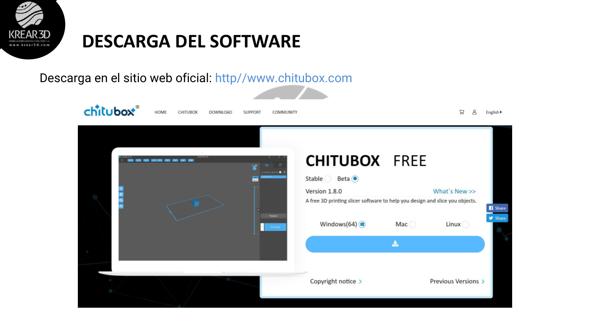

**[SCREENSHOT NUEVO A TOMAR: Página oficial de descarga de CHITUBOX actualizada]**

---

## 3. Agregar o seleccionar tu impresora

Al abrir CHITUBOX por primera vez, debes agregar el modelo de impresora que usarás.

Pasos:

1. Abre el panel de impresoras o gestión de máquinas.
2. Busca la marca y modelo de tu equipo.
3. Selecciona el modelo correcto.
4. Verifica volumen de impresión, resolución y formato de archivo.
5. Guarda la configuración.

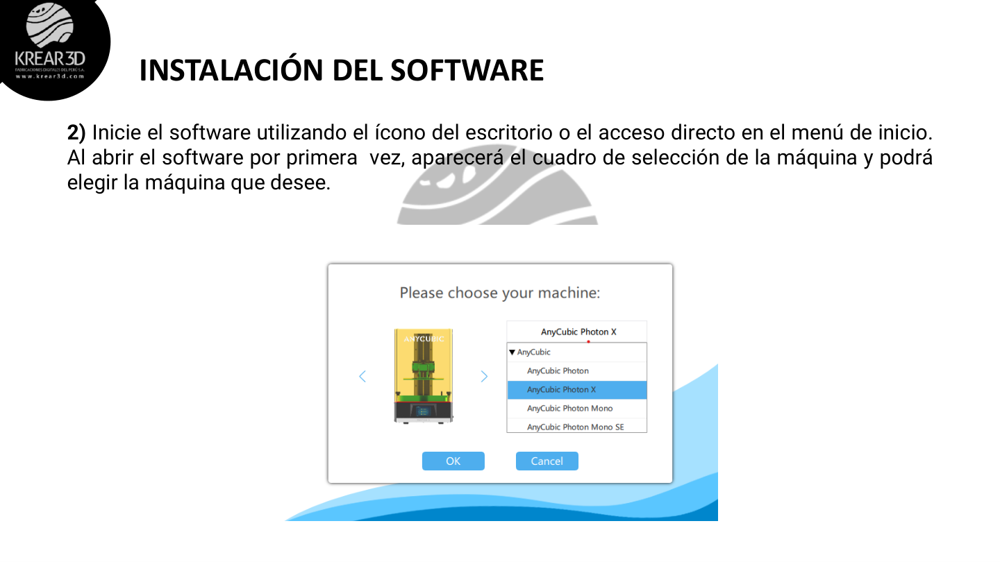

**Importante:** no modifiques la resolución ni el tamaño de impresión de un perfil preconfigurado salvo que soporte técnico lo indique. Un perfil incorrecto puede generar archivos incompatibles o impresiones fallidas.

**[SCREENSHOT NUEVO A TOMAR: Ventana actual de agregar impresora en CHITUBOX]**

---

## 4. Conoce la interfaz principal

La interfaz de CHITUBOX se organiza en varias zonas:

- **Menú principal:** abrir proyecto, guardar, abrir archivo, recientes, idioma y ayuda.
- **Área de trabajo:** plataforma virtual donde se ubica el modelo.
- **Herramientas de edición:** mover, rotar, escalar, espejo, duplicar.
- **Panel de soportes:** agrega soportes automáticos o manuales.
- **Panel de laminado:** parámetros de exposición, altura de capa y velocidades.
- **Vista previa:** revisión capa por capa antes de imprimir.

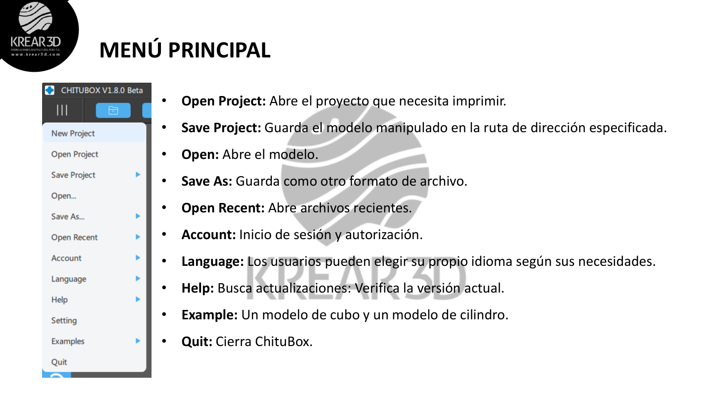

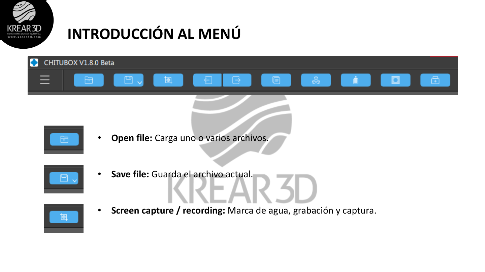

**[SCREENSHOT NUEVO A TOMAR: Interfaz actual completa de CHITUBOX con zonas marcadas]**

---

## 5. Importar un modelo STL, OBJ o 3MF

Para cargar un modelo:

1. Haz clic en **Open** o **Abrir archivo**.
2. Selecciona el archivo STL, OBJ o 3MF.
3. Verifica que el modelo aparezca sobre la plataforma.
4. Confirma que la pieza esté dentro del volumen de impresión.

**Tip K3D:** si el modelo aparece demasiado grande, fuera de la plataforma o con orientación extraña, corrígelo antes de generar soportes.

**[SCREENSHOT NUEVO A TOMAR: Botón Open / Abrir archivo]**  
**[SCREENSHOT NUEVO A TOMAR: Modelo cargado sobre la plataforma]**

---

## 6. Herramientas básicas del modelo

### Mover

Permite cambiar la posición del modelo en los ejes X, Y y Z.

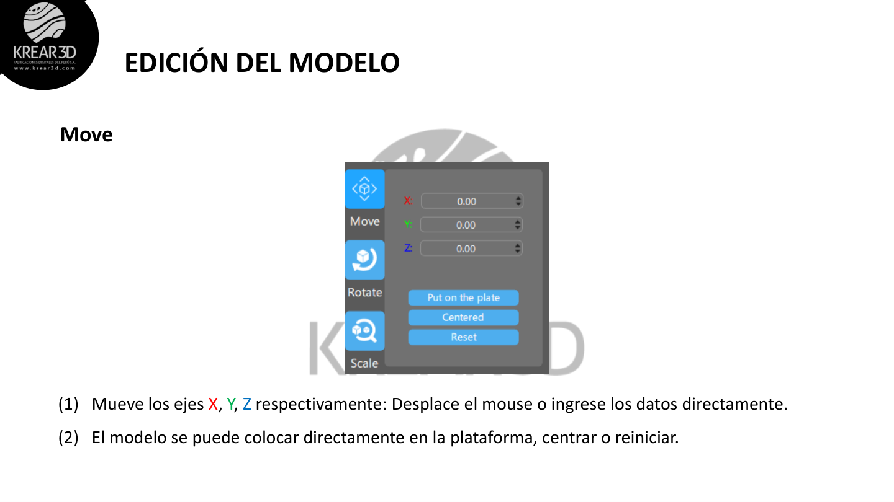

### Rotar

Permite orientar la pieza para mejorar el acabado, reducir fallas y colocar soportes de forma correcta.

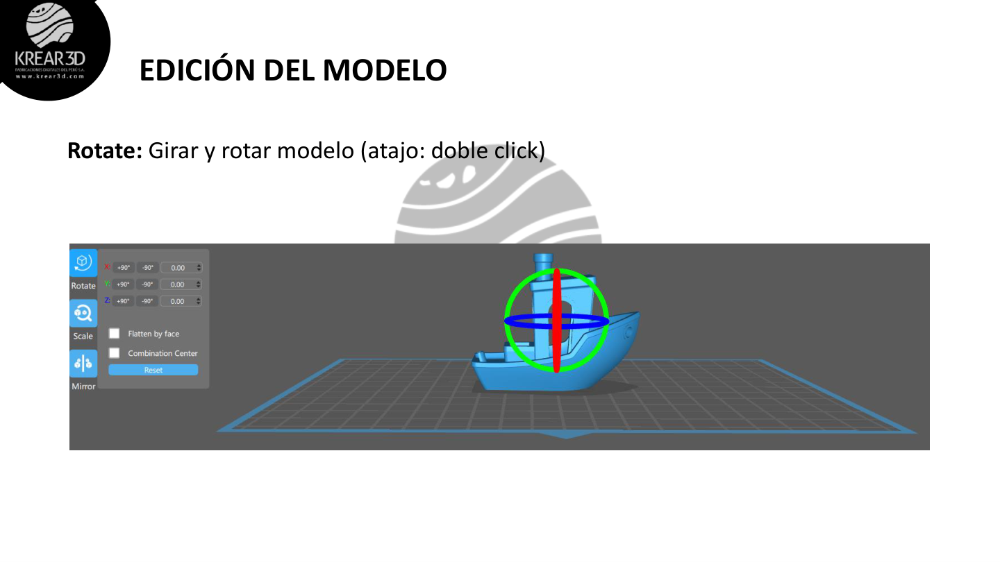

### Escalar

Permite aumentar o reducir el tamaño del modelo.

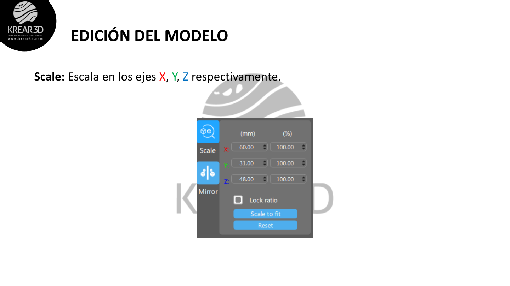

### Espejo y duplicado

Permite invertir el modelo o crear copias para imprimir varias piezas en una sola plataforma.

**Recomendación K3D:** no llenes toda la cama si recién estás aprendiendo. Empieza con una pieza pequeña para validar exposición, soportes y adherencia.

---

## 7. Orientar la pieza

La orientación es una de las decisiones más importantes en impresión de resina.

Una buena orientación ayuda a:

- reducir marcas visibles de soportes;
- disminuir fuerza de succión sobre el FEP;
- mejorar adherencia a la plataforma;
- evitar piezas deformadas;
- ahorrar resina y tiempo.

Recomendaciones generales:

- Evita imprimir piezas grandes completamente planas contra el FEP.
- Inclina modelos entre 30° y 45° cuando sea conveniente.
- Coloca soportes en zonas menos visibles.
- Revisa que no queden islas sin soporte en la vista previa.

**[SCREENSHOT NUEVO A TOMAR: Modelo orientado en diagonal con soportes]**

---

## 8. Vaciar modelos y agregar agujeros de drenaje

En piezas grandes, puede ser conveniente vaciar el modelo para reducir consumo de resina y peso.

### Hollow / Vaciar

Permite crear una pieza hueca con un espesor de pared definido.

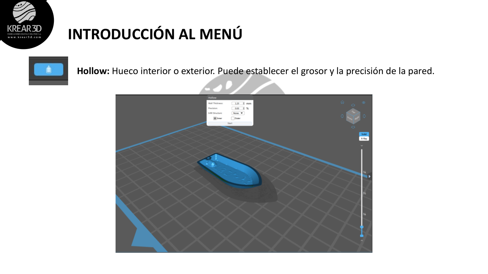

### Dig Hole / Agujeros de drenaje

Permite agregar orificios para que la resina líquida pueda salir del interior de la pieza.

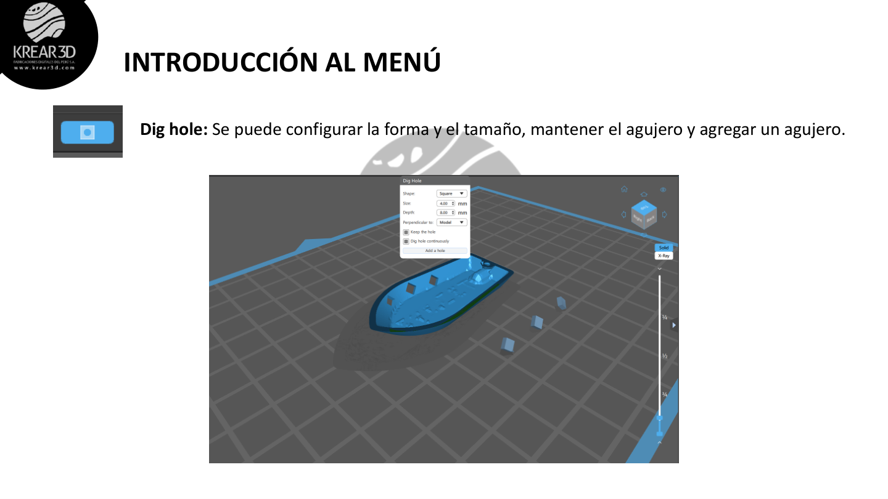

Recomendaciones:

- Usa espesor de pared suficiente para evitar piezas frágiles.
- Agrega al menos dos agujeros de drenaje cuando el modelo esté hueco.
- Ubica los agujeros en zonas poco visibles.
- Lava bien el interior de la pieza antes del curado final.

**Tip K3D:** no dejes modelos huecos sin drenaje. La resina atrapada puede generar presión interna, mal olor, filtraciones o deformaciones con el tiempo.

---

## 9. Configurar parámetros de laminado

Los parámetros dependen de la impresora, resina, color, temperatura ambiente y altura de capa.

Parámetros principales:

- **Layer Height / Altura de capa:** detalle vertical de impresión.
- **Bottom Exposure / Exposición de base:** tiempo de exposición de las primeras capas.
- **Normal Exposure / Exposición normal:** tiempo de exposición de las capas regulares.
- **Bottom Layers / Capas inferiores:** cantidad de capas reforzadas para adherencia.
- **Lift Distance / Distancia de elevación:** separación entre capa y FEP.
- **Lift Speed / Velocidad de elevación:** velocidad de movimiento al despegar cada capa.

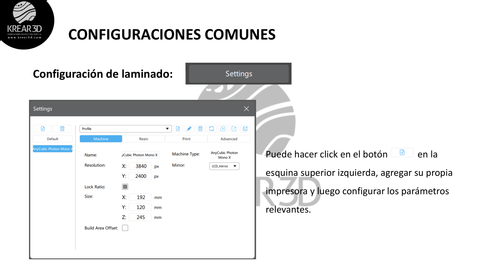

**Recomendación K3D:** empieza con el perfil recomendado por el fabricante de la resina o por Krear 3D. Luego ajusta de forma gradual.

**[SCREENSHOT NUEVO A TOMAR: Panel actual de parámetros de exposición en CHITUBOX]**

---

## 10. Agregar soportes

Las piezas de resina suelen necesitar soportes para imprimirse correctamente.

Opciones comunes:

- **Light:** soportes ligeros para piezas pequeñas o detalles finos.
- **Medium:** soporte equilibrado para uso general.
- **Heavy:** soporte fuerte para piezas pesadas o con mayor fuerza de succión.

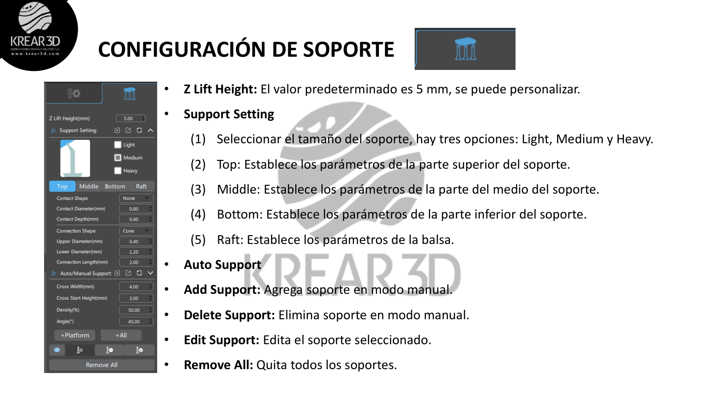

Buenas prácticas:

- Usa soportes más fuertes en la base o zonas de mayor carga.
- Refuerza zonas con islas detectadas en la vista previa.
- Evita colocar soportes en superficies visibles si puedes orientar la pieza mejor.
- Revisa manualmente los soportes automáticos.

**[SCREENSHOT NUEVO A TOMAR: Soportes automáticos y soportes manuales en CHITUBOX]**

---

## 11. Laminar el modelo

Cuando el modelo esté orientado, soportado y configurado, puedes laminar.

Pasos:

1. Haz clic en **Slice** o **Laminar**.
2. Espera el procesamiento del archivo.
3. Revisa tiempo estimado y consumo de resina.
4. Abre la vista previa.

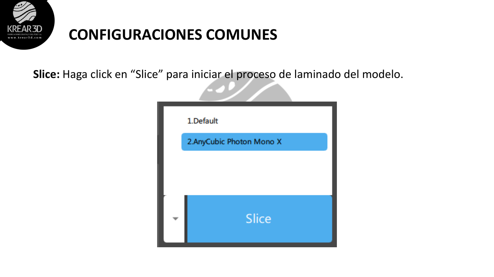

---

## 12. Revisar vista previa

La vista previa permite revisar el archivo capa por capa antes de imprimir.

Verifica:

- que no existan islas sin soporte;
- que la primera capa esté correcta;
- que los soportes se generen desde zonas adecuadas;
- que no existan partes flotando;
- que el modelo no sobrepase el área de impresión;
- que el archivo corresponda al formato de tu impresora.

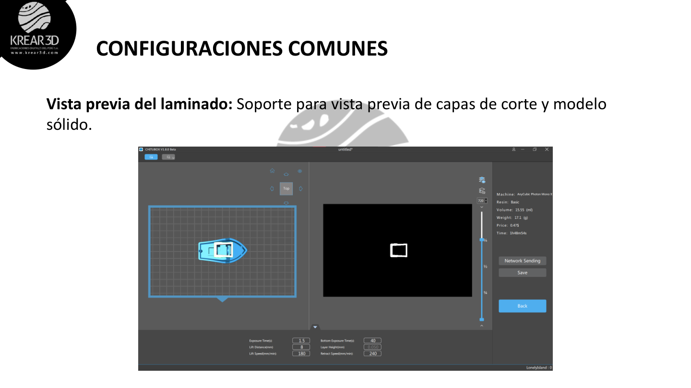

**Tip K3D:** nunca imprimas un archivo de resina sin revisar la vista previa. Puede evitar pérdida de resina, fallas y daño en el FEP.

---

## 13. Guardar archivo para imprimir

Después de laminar:

1. Guarda el archivo en tu computadora.
2. Copia el archivo final al USB si tu impresora trabaja con memoria externa.
3. Inserta el USB en la impresora.
4. Selecciona el archivo desde la pantalla del equipo.
5. Inicia la impresión.

**Recomendación K3D:** evita guardar directamente desde el slicer al USB si notas errores de lectura. Guarda primero en la computadora y luego copia el archivo.

---

## 14. Checklist antes de imprimir

Antes de iniciar una impresión de resina, revisa:

- la plataforma está limpia y bien nivelada;
- el FEP está limpio, tenso y sin daños visibles;
- la resina está filtrada o bien agitada;
- la impresora corresponde al perfil seleccionado;
- la exposición es adecuada para la resina;
- el modelo tiene soportes suficientes;
- revisaste la vista previa;
- tienes guantes, mascarilla y espacio ventilado.

---

## 15. Soporte Krear 3D

Si necesitas ayuda, envía fotos o videos del caso para poder orientarte mejor.

**Soporte técnico vía WhatsApp:** +51 970 539 751  
**Atención únicamente por chat.**
