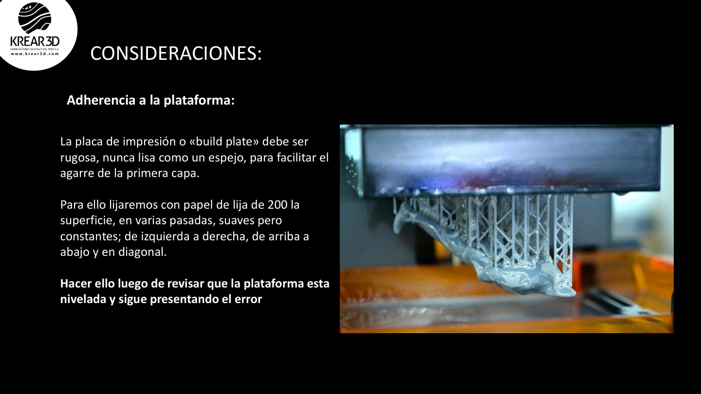
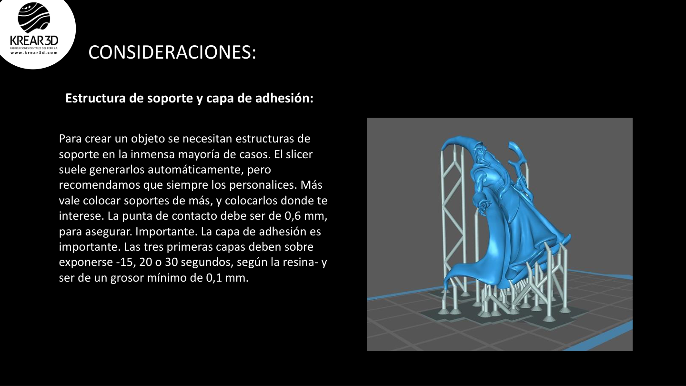
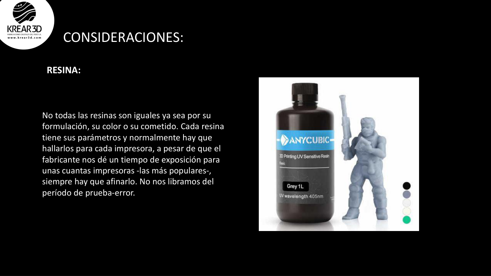
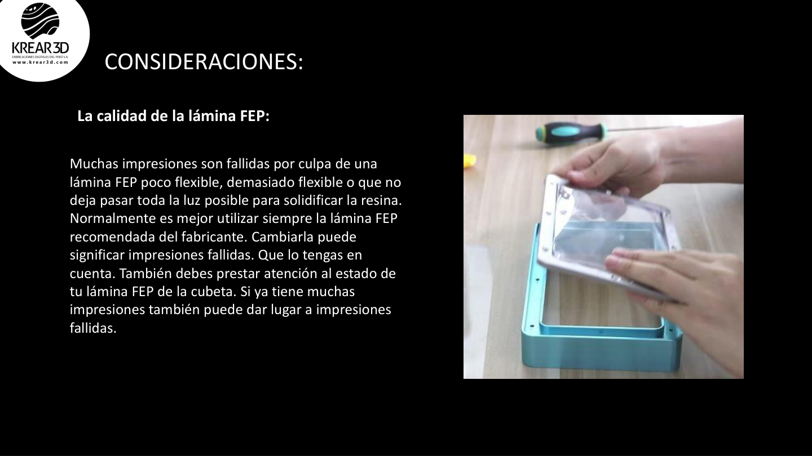
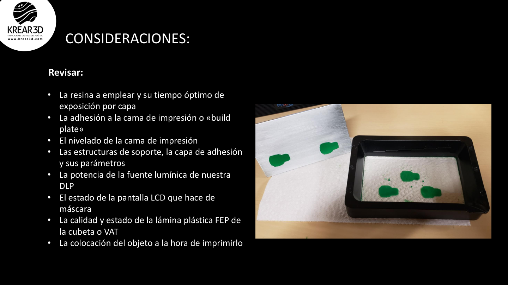

# Wiki LCD / Resina: Errores comunes y soluciones

Esta guía ayuda a identificar problemas frecuentes en impresoras LCD, MSLA y DLP.

---

## 1. La pieza no se pega a la plataforma

### Síntoma

La pieza queda pegada al FEP, aparece solo una base parcial o no se forma nada sobre la plataforma.

### Posibles causas

- plataforma mal nivelada;
- exposición de base insuficiente;
- superficie de plataforma demasiado lisa;
- FEP muy tenso, dañado o desgastado;
- resina fría o mal mezclada;
- soportes o base mal configurados.

### Soluciones

- nivelar nuevamente la plataforma;
- aumentar ligeramente la exposición de base;
- limpiar plataforma y tanque;
- revisar estado del FEP;
- agitar la resina;
- usar raft o base de soporte adecuada.

---

## 2. La pieza se despega a mitad de impresión

### Síntoma

La impresión empieza bien pero luego se desprende o queda incompleta.

### Posibles causas

- soportes débiles;
- demasiada fuerza de succión;
- pieza muy grande y plana;
- velocidad de elevación alta;
- exposición normal baja.

### Soluciones

- mejorar orientación;
- agregar soportes medianos o fuertes en zonas críticas;
- reducir áreas planas paralelas al FEP;
- ajustar velocidad de elevación;
- revisar exposición normal.

---

## 3. Soportes fallan o se rompen

### Síntoma

Los soportes se imprimen, pero la pieza no queda sostenida o aparecen partes faltantes.

### Posibles causas

- soportes muy ligeros;
- punta de soporte muy pequeña;
- pocas conexiones;
- mala orientación;
- islas sin soporte.

### Soluciones

- usar soportes Medium o Heavy en zonas importantes;
- aumentar diámetro de contacto;
- revisar islas en la vista previa;
- agregar soportes manuales;
- orientar la pieza para reducir voladizos.

---

## 4. Capas separadas o líneas visibles

### Síntoma

La pieza presenta cortes, bandas o capas mal adheridas.

### Posibles causas

- exposición insuficiente;
- movimiento Z irregular;
- resina mal mezclada;
- temperatura baja;
- FEP en mal estado.

### Soluciones

- aumentar exposición normal de forma gradual;
- revisar eje Z;
- mezclar bien la resina;
- imprimir en ambiente estable;
- reemplazar FEP si está dañado.

---

## 5. Detalles blandos o sobreexpuestos

### Síntoma

Los detalles finos se pierden, los bordes se ven gruesos o la pieza queda inflada.

### Posibles causas

- exposición demasiado alta;
- altura de capa inadecuada;
- antialiasing mal configurado;
- resina no adecuada para detalle fino.

### Soluciones

- reducir exposición normal poco a poco;
- usar altura de capa menor;
- revisar perfil de resina;
- hacer test de exposición.

---

## 6. Piezas huecas con resina atrapada

### Síntoma

La pieza gotea, se agrieta, huele fuerte o se deforma con el tiempo.

### Posibles causas

- modelo hueco sin agujeros de drenaje;
- agujeros demasiado pequeños;
- lavado interno insuficiente;
- curado incompleto del interior.

### Soluciones

- agregar dos o más agujeros de drenaje;
- lavar el interior;
- dejar secar completamente;
- curar el interior si es posible.

---

## 7. Marcas excesivas de soporte

### Síntoma

La pieza tiene puntos, cráteres o marcas visibles donde se retiraron soportes.

### Posibles causas

- soportes muy gruesos en zonas visibles;
- retiro brusco;
- mala orientación;
- curado antes de retirar soportes.

### Soluciones

- orientar para colocar soportes en zonas ocultas;
- usar soportes más finos en detalles;
- retirar soportes con alicate;
- lijar o reparar superficialmente si es necesario.

---

## 8. Fallas por FEP

### Síntoma

Impresiones repetidamente fallidas, capas pegadas al tanque, marcas o deformaciones.

### Posibles causas

- FEP rayado;
- FEP opaco;
- FEP demasiado flojo o tenso;
- residuos pegados en el tanque.

### Soluciones

- revisar visualmente el FEP;
- limpiar con cuidado;
- reemplazar si está dañado;
- evitar espátulas metálicas sobre el FEP.

---

## 9. Checklist rápido de diagnóstico

Cuando una impresión falla, revisa en este orden:

1. ¿La plataforma está nivelada?
2. ¿La resina está bien mezclada?
3. ¿La exposición corresponde a la resina?
4. ¿El FEP está en buen estado?
5. ¿El modelo tiene soportes suficientes?
6. ¿Hay islas sin soporte?
7. ¿La orientación reduce succión?
8. ¿El archivo corresponde a tu impresora?

