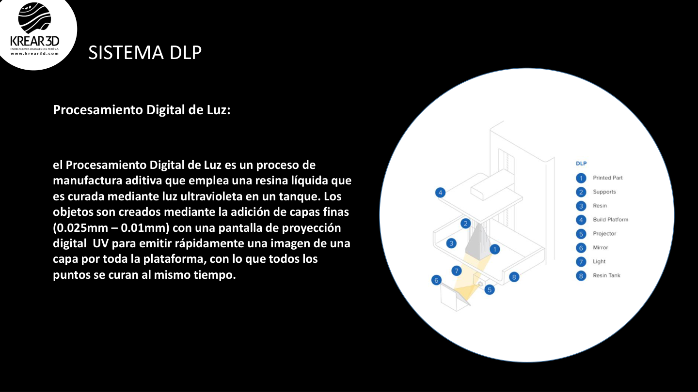

# Wiki LCD / Resina: Tecnología LCD, MSLA y DLP

Esta guía explica de forma simple cómo funciona la impresión 3D de resina y qué conceptos debe conocer un usuario antes de iniciar.

---

## 1. ¿Qué es la impresión 3D de resina?

La impresión 3D de resina fabrica piezas usando una resina líquida fotosensible que se solidifica mediante luz UV. La pieza se forma capa por capa, con alta precisión y gran nivel de detalle.

Se usa principalmente para:

- figuras y coleccionables;
- piezas dentales o modelos de alta precisión;
- prototipos pequeños;
- miniaturas;
- joyería y moldes;
- piezas con detalles finos.

---

## 2. LCD / MSLA / DLP: ¿en qué se diferencian?

### LCD / MSLA

Usa una pantalla LCD monocromática o similar para proyectar la imagen de cada capa y curar la resina con luz UV.

### DLP

Usa un proyector digital para curar la imagen de cada capa. En tus recursos antiguos se explica como un proceso de manufactura aditiva donde la resina líquida se cura mediante luz ultravioleta en un tanque, agregando capas finas y curando todos los puntos de la capa al mismo tiempo.

### SLA

Usa un láser para curar la resina punto por punto. No es el enfoque principal de esta guía, pero pertenece a la familia de tecnologías de fotopolimerización.

---

## 3. Partes principales de una impresora de resina

- **Cubeta o tanque de resina:** contiene la resina líquida.
- **FEP o film:** lámina transparente en la base del tanque.
- **Plataforma de impresión:** superficie donde se adhiere la pieza.
- **Pantalla LCD / fuente UV:** genera la luz que cura cada capa.
- **Eje Z:** mueve la plataforma durante la impresión.
- **Tapa protectora:** reduce exposición a luz externa y contiene vapores.

**[IMAGEN SUGERIDA: Diagrama propio de partes de una impresora LCD]**

---

## 4. Flujo general de trabajo

1. Descargar o diseñar un modelo 3D.
2. Abrir el modelo en CHITUBOX u otro slicer.
3. Orientar la pieza.
4. Vaciar si corresponde.
5. Agregar agujeros de drenaje si la pieza está hueca.
6. Colocar soportes.
7. Configurar exposición y altura de capa.
8. Laminar.
9. Imprimir.
10. Lavar.
11. Secar.
12. Retirar soportes.
13. Curar con luz UV.

---

## 5. Ventajas de la impresión de resina

- Mayor detalle que FDM.
- Capas menos visibles.
- Mejor acabado superficial.
- Ideal para piezas pequeñas y detalladas.
- Muy útil para figuras, miniaturas y dental.

---

## 6. Consideraciones importantes

La resina requiere más cuidado que el filamento FDM:

- usar guantes y protección;
- evitar contacto directo con la piel;
- trabajar en un ambiente ventilado;
- limpiar piezas con alcohol isopropílico o método recomendado por la resina;
- curar piezas antes de manipularlas de forma final;
- no botar resina líquida al desagüe.

---

## 7. Cuándo elegir resina y cuándo elegir FDM

| Necesidad | Mejor opción |
|---|---|
| Figuras detalladas | Resina |
| Miniaturas | Resina |
| Piezas grandes y económicas | FDM |
| Piezas funcionales resistentes | FDM o resina técnica |
| Modelos dentales | Resina |
| Prototipos rápidos grandes | FDM |

---

## 8. Soporte Krear 3D

Para dudas de configuración, exposición o fallas de impresión, envía fotos o videos del caso al soporte técnico.
