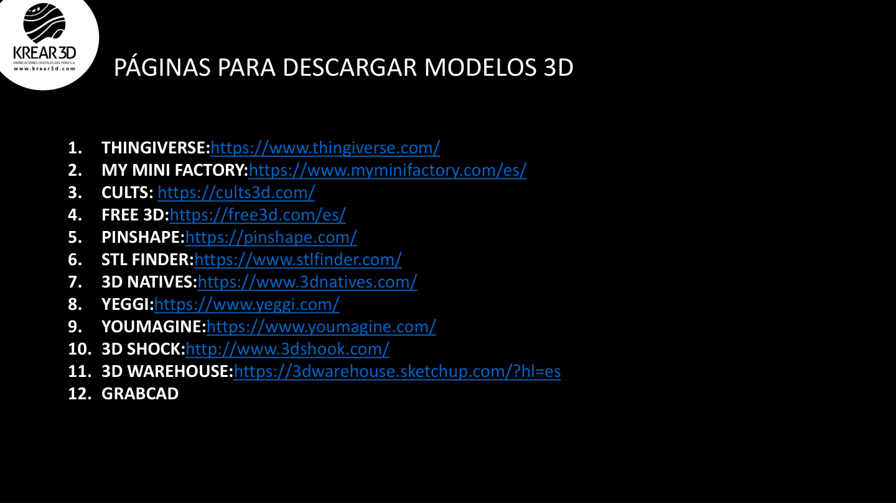
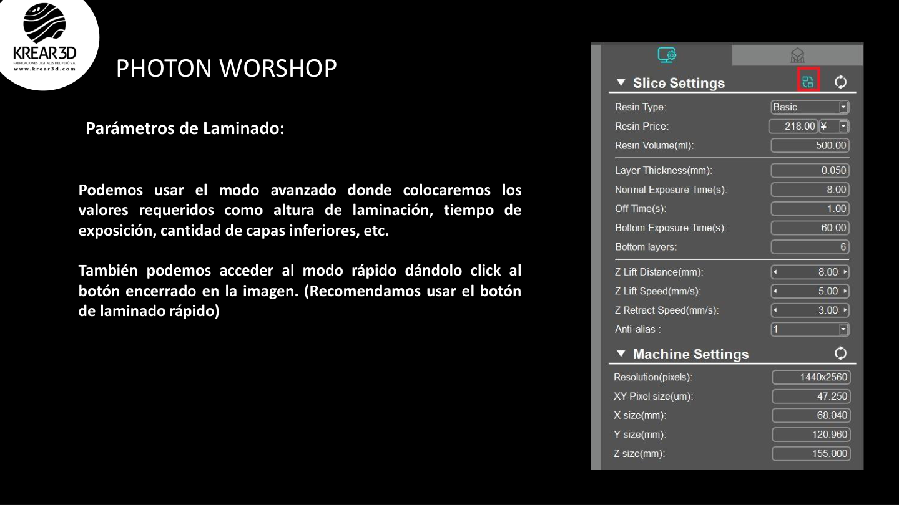

# Wiki LCD / Resina: Modelos y diseño para impresión de resina

Esta guía ayuda a elegir, preparar y diseñar modelos adecuados para impresoras LCD, MSLA o DLP.

---

## 1. Elegir modelos adecuados

La impresión de resina funciona especialmente bien para modelos con alto nivel de detalle.

Modelos recomendados:

- miniaturas;
- bustos;
- figuras coleccionables;
- piezas dentales;
- joyería;
- prototipos pequeños;
- modelos con texturas finas.

Modelos menos recomendados:

- piezas muy grandes y macizas;
- piezas que necesitan mucha resistencia mecánica;
- objetos de uso rudo;
- modelos huecos sin drenaje.

**Recomendación K3D:** en la web, prioriza K3D FAB como fuente de modelos recomendados y deja otros repositorios como recursos externos secundarios.

---

## 2. Orientación de la pieza

La orientación afecta acabado, soportes, tiempo y probabilidad de falla.

Buenas prácticas:

- inclina modelos grandes;
- evita superficies grandes paralelas al FEP;
- ubica soportes en zonas menos visibles;
- distribuye la fuerza de succión;
- revisa el resultado capa por capa.

---

## 3. Piezas huecas

Vaciar una pieza ayuda a reducir consumo de resina y peso.

Recomendaciones:

- no uses paredes demasiado delgadas;
- agrega agujeros de drenaje;
- evita cavidades cerradas;
- lava el interior;
- cura correctamente.

---

## 4. Agujeros de drenaje

Los agujeros permiten que salga resina líquida atrapada dentro de modelos huecos.

Buenas prácticas:

- coloca mínimo dos agujeros;
- ubícalos en la zona inferior según orientación;
- evita que queden bloqueados por soportes;
- hazlos suficientemente grandes para lavar el interior.

---

## 5. Soportes desde el diseño

Al diseñar o elegir un modelo, piensa en los soportes desde el inicio.

Un buen diseño para resina:

- evita voladizos innecesarios;
- divide piezas complejas en partes;
- deja superficies visibles libres de soportes;
- incluye encajes si el modelo se imprimirá por partes.

---

## 6. Encajes y tolerancias

Para piezas que ensamblan:

- deja holgura entre piezas;
- evita encajes demasiado ajustados;
- prueba con piezas pequeñas antes de imprimir todo el modelo;
- considera contracción o variación según resina.

Valores de referencia:

| Tipo de encaje | Holgura inicial sugerida |
|---|---:|
| Encaje decorativo | 0.10–0.20 mm |
| Encaje manual normal | 0.20–0.40 mm |
| Piezas que deben entrar fácil | 0.40–0.60 mm |

---

## 7. Modelos grandes

Para modelos grandes:

- dividir en partes puede mejorar el resultado;
- usar pines o encajes facilita el armado;
- vaciar reduce consumo;
- agregar drenajes evita resina atrapada;
- orientar cada parte de forma independiente.

---

## 8. Checklist antes de laminar un modelo

- el modelo cabe en la plataforma;
- la orientación reduce succión;
- hay soportes suficientes;
- no hay islas sin soporte;
- si está hueco, tiene drenajes;
- las zonas visibles tienen pocos soportes;
- el archivo no está dañado;
- el formato es compatible con el slicer.

---

## 9. Nota K3D

Un buen resultado en resina depende tanto del modelo como de la configuración. Antes de imprimir piezas grandes o costosas, haz una prueba pequeña de exposición y soporte.
