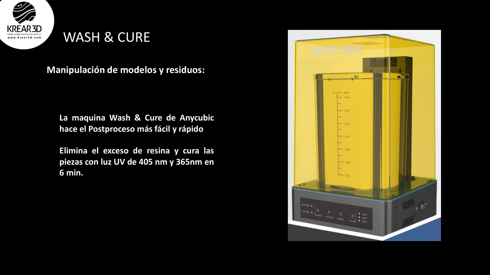
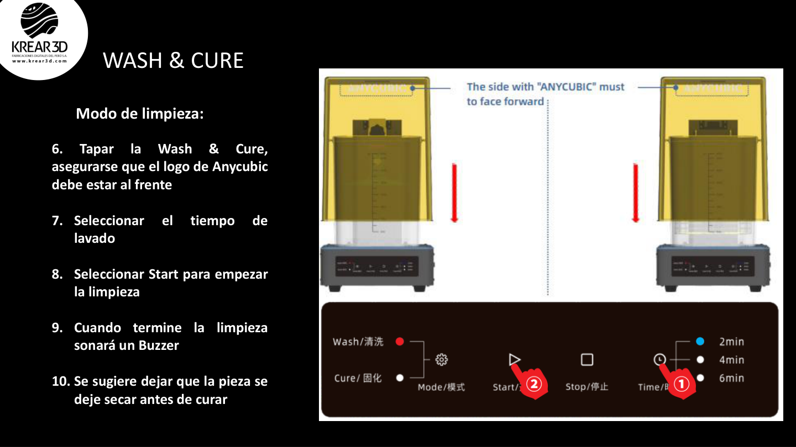
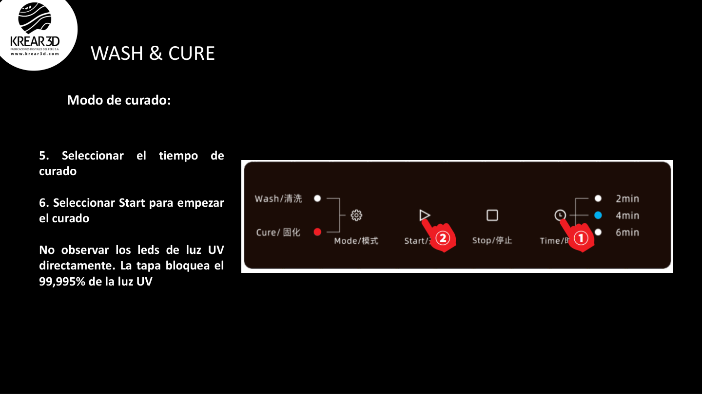

# Wiki LCD / Resina: Postproceso, lavado y curado

El postproceso es la etapa posterior a la impresión. En resina, es tan importante como la configuración del archivo.

---

## 1. ¿Por qué es necesario el postproceso?

Cuando una pieza sale de la impresora, todavía tiene resina líquida en la superficie y no está completamente curada. Por eso necesita:

1. escurrir;
2. lavar;
3. secar;
4. retirar soportes;
5. curar con luz UV.

---

## 2. Retirar la pieza de la plataforma

Pasos:

1. Usa guantes.
2. Retira la plataforma de impresión.
3. Deja escurrir la resina sobrante.
4. Usa una espátula adecuada para separar la pieza.
5. Evita ejercer fuerza excesiva que pueda romper la pieza.

---

## 3. Lavado

El lavado elimina la resina no curada de la superficie.

Puedes usar una estación Wash & Cure o un recipiente manual con alcohol isopropílico, según la resina utilizada.

Flujo recomendado:

1. Coloca la pieza en el recipiente de lavado.
2. Lava durante el tiempo recomendado.
3. Retira la pieza.
4. Deja secar antes del curado.

**Tip K3D:** no cures una pieza que aún esté húmeda con alcohol. Puede quedar pegajosa, blanquecina o con acabado irregular.

---

## 4. Retirar soportes

Puedes retirar soportes antes o después del curado, dependiendo del tipo de resina y geometría.

Recomendación general:

- retira soportes con cuidado antes del curado final si quieres reducir marcas;
- usa pinzas o alicate de corte;
- evita tirar los soportes con fuerza;
- lija suavemente si quedan marcas.

---

## 5. Curado UV

El curado final mejora la resistencia y estabilidad de la pieza.

Pasos:

1. Coloca la pieza seca en la estación de curado.
2. Selecciona el tiempo según tamaño y resina.
3. Gira la pieza si es necesario para curado uniforme.
4. No mires directamente los LEDs UV.

---

## 6. Tiempos de referencia

Los tiempos dependen de la resina, tamaño, color y potencia UV.

| Tipo de pieza | Lavado aprox. | Curado aprox. |
|---|---:|---:|
| Miniatura pequeña | 2–4 min | 2–5 min |
| Pieza mediana | 4–6 min | 5–8 min |
| Pieza grande | 6–10 min | 8–15 min |
| Pieza hueca | Revisar interior | Curado por etapas |

**Nota:** usa siempre las recomendaciones del fabricante de la resina como referencia principal.

---

## 7. Errores comunes en postproceso

### La pieza queda pegajosa

Posibles causas:

- lavado insuficiente;
- pieza curada aún húmeda;
- curado incompleto;
- resina acumulada en cavidades.

Solución:

- lavar nuevamente;
- secar completamente;
- curar por más tiempo;
- revisar agujeros de drenaje si la pieza es hueca.

### La pieza se deforma

Posibles causas:

- curado excesivo;
- pieza delgada;
- mal soporte;
- exposición irregular.

Solución:

- reducir tiempo de curado;
- orientar mejor;
- reforzar paredes o soportes;
- curar por etapas.

---

## 8. Checklist de postproceso

- pieza retirada con guantes;
- resina sobrante escurrida;
- pieza lavada;
- pieza seca;
- soportes retirados con cuidado;
- pieza curada correctamente;
- residuos tratados de forma segura.
