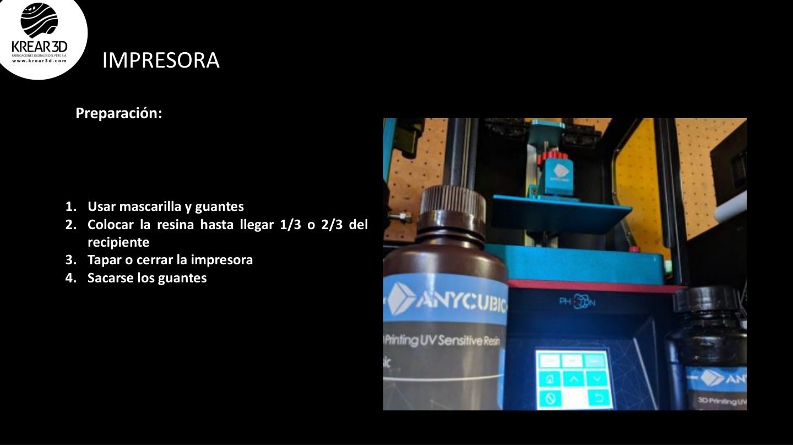
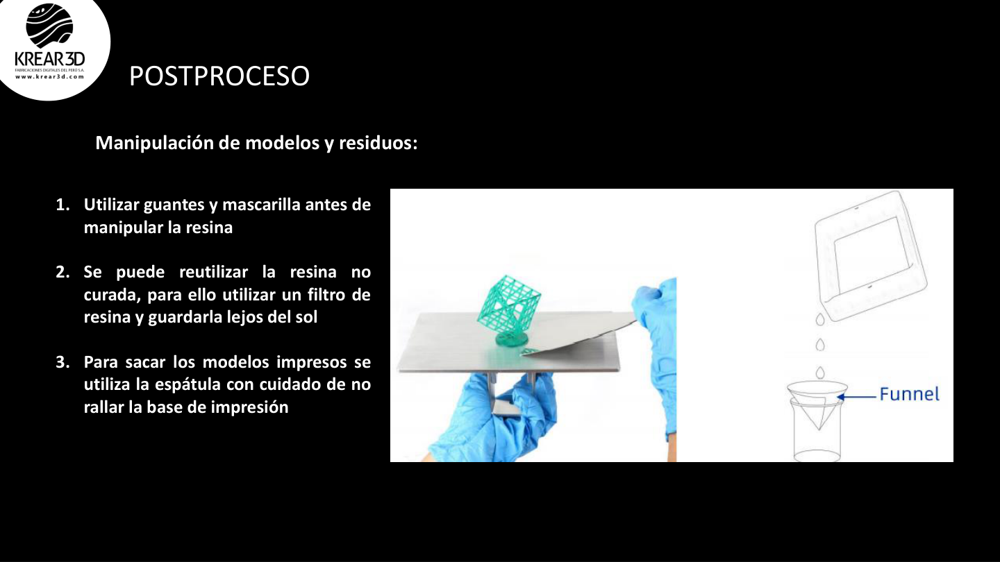

# Wiki LCD / Resina: Seguridad y manipulación de resina

La impresión 3D con resina ofrece gran detalle, pero requiere cuidados especiales. Esta guía resume buenas prácticas de seguridad para usuarios nuevos.

---

## 1. Antes de empezar

Prepara tu espacio de trabajo:

- superficie estable y fácil de limpiar;
- buena ventilación;
- guantes disponibles;
- mascarilla si el ambiente lo requiere;
- papel absorbente;
- recipiente para residuos;
- alcohol isopropílico o limpiador recomendado;
- filtros de resina;
- luz UV o estación Wash & Cure para curado.

---

## 2. Protección personal

Usa siempre:

- guantes de nitrilo;
- lentes de protección si hay riesgo de salpicaduras;
- mascarilla en espacios con poca ventilación;
- ropa o mandil que puedas limpiar fácilmente.

No manipules resina líquida con las manos descubiertas.

---

## 3. Manipulación de resina

Buenas prácticas:

- agita la botella antes de usarla;
- vierte la resina lentamente para evitar derrames;
- no llenes demasiado la cubeta;
- mantén la botella cerrada cuando no la uses;
- evita exposición directa al sol;
- filtra la resina usada antes de devolverla a la botella.

---

## 4. Resina sobrante

La resina no curada puede reutilizarse si está limpia.

Pasos:

1. Retira la cubeta con cuidado.
2. Filtra la resina usando un filtro adecuado.
3. Guarda la resina en una botella opaca o en su envase original.
4. Mantén el envase lejos del sol y del calor.

---

## 5. Limpieza del área

Si cae resina:

1. Usa guantes.
2. Absorbe el derrame con papel.
3. Limpia la zona con alcohol o limpiador adecuado.
4. Cura el papel contaminado con luz UV antes de desecharlo.

---

## 6. Residuos

No arrojes resina líquida ni alcohol contaminado al lavadero.

Recomendaciones:

- cura los residuos de resina antes de desecharlos;
- guarda alcohol contaminado en un recipiente cerrado;
- consulta la normativa local para manejo de residuos químicos;
- mantén los residuos lejos de niños y mascotas.

---

## 7. Checklist de seguridad

Antes de imprimir:

- tengo guantes;
- la zona está ventilada;
- la cubeta está limpia;
- el FEP no está dañado;
- tengo papel y alcohol para limpieza;
- la resina está bien mezclada;
- no hay luz solar directa sobre la resina.

Después de imprimir:

- retiro la pieza con guantes;
- limpio la plataforma;
- filtro resina sobrante si corresponde;
- lavo la pieza;
- curo la pieza;
- limpio el área de trabajo.

---

## 8. Nota K3D

La resina líquida debe tratarse con cuidado. Una buena rutina de seguridad evita accidentes, piezas contaminadas y problemas de limpieza.
